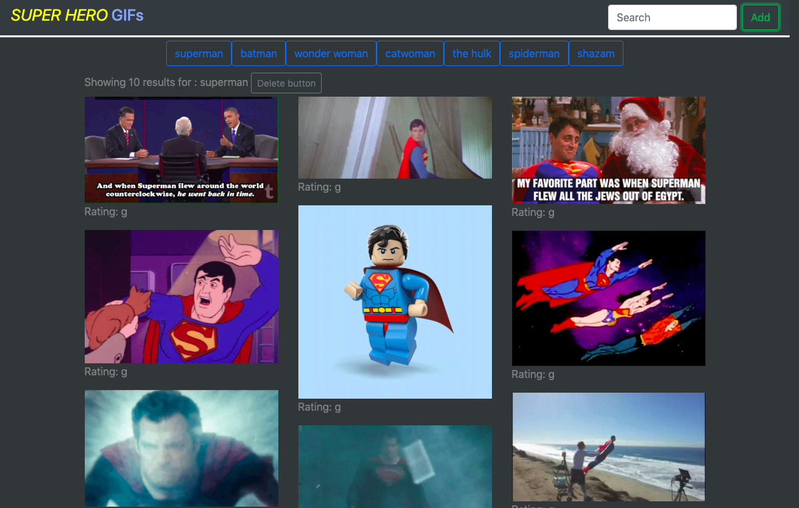

# GifTastic

### Overview

Using the GIPHY API to make a dynamic web page that populates with gifs of your choice. App calls the GIPHY API and uses JavaScript and jQuery to change the HTML on the site.

